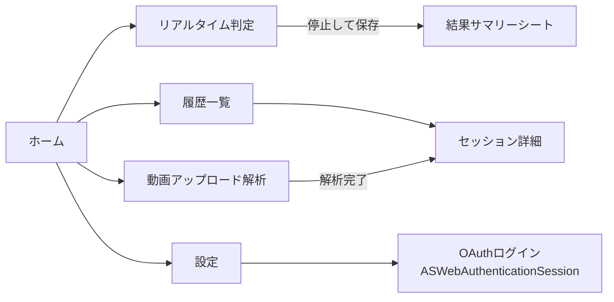
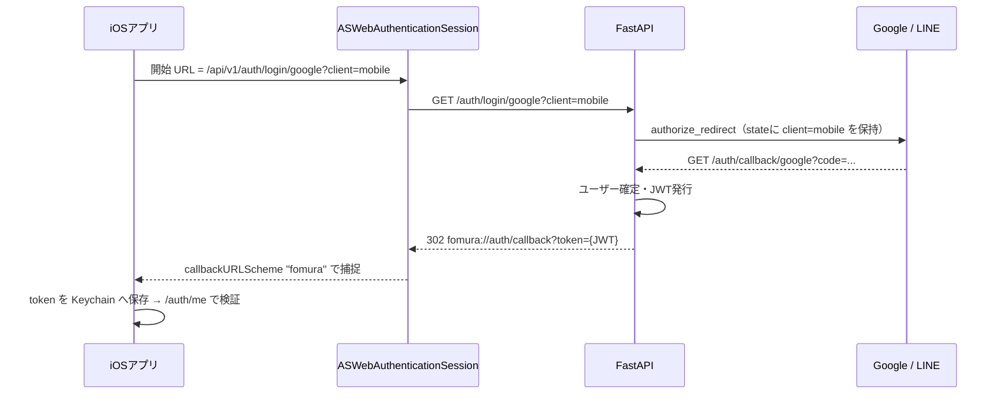

# Fomura iOS モバイル設計書 

## 1. はじめに

### 1.1. 本書の目的

本書は， Fomura（筋トレ特化型 骨格モーション評価システム）を **iOSで作成するのための詳細設計書** です．結論として，「①判定ロジック層（TypeScript → Swift の忠実移植）」「②カメラ・推論層（ブラウザAPI → AVFoundation + MediaPipe Tasks iOS）」「③UI層（Next.js → SwiftUI）」「④通信・認証層（fetch/localStorage → URLSession/Keychain）」の4層に分解でき，判定ロジックのしきい値・数式は**一切変更せず**そのまま移植することで，Web版・バックエンドと評価基準の互換性を保ちます．

### 1.2. スコープ

| 区分 | 内容 |
|---|---|
| 対象 | リアルタイムフォーム判定（カメラ・骨格描画・レップ計数・採点・警告・撮影ガイド），セッション保存・履歴閲覧，OAuth認証，録画動画アップロード解析 |
| 対象外 | バックエンド自体の再実装（既存 FastAPI をそのまま利用），Android版，Apple Watch連携（将来拡張として付録に記載） |

**表1: 本書のスコープ**

### 1.3. 前提条件

- 姿勢推定エンジンは **MediaPipe Tasks Vision for iOS**（BlazePose 33関節）を採用します．Web版 `frontend/lib/pose/` およびバックエンド `app/analysis/` とランドマーク体系が完全一致するため，判定ロジックをしきい値込みで無変更移植できます．
- バックエンドは既存の FastAPI（`/api/v1/...`）をそのまま利用します．ただし**モバイル用OAuthコールバック**のみ小規模な追加改修が必要です（第9章）．
- 開発環境: Xcode 16以降 / Swift 5.10以降 / 最低対応OS **iOS 17.0**（SwiftData・`@Observable` マクロを利用するため）．

---

## 2. 移植対象機能の完全一覧

Web版の全機能を洗い出し，iOS側の対応方針を定義します．

| # | Web版の機能 | 実装元ファイル | iOS対応 | 方針 |
|---|---|---|---|---|
| F01 | ホーム画面（モード選択・ログイン導線） | `app/page.tsx` | ○ | SwiftUI `HomeView` |
| F02 | リアルタイム判定画面（スマホ優先レイアウト） | `app/live/page.tsx` | ○ | SwiftUI `LiveSessionView` |
| F03 | カメラ起動・前面/背面切替・鏡像表示 | `CameraView.tsx` | ○ | AVFoundation `CameraService` |
| F04 | 姿勢推定（33関節・GPU/CPUフォールバック） | `usePoseLandmarker.ts` | ○ | MediaPipe Tasks iOS `PoseEngine` |
| F05 | 骨格スケルトンのオーバーレイ描画 | `CameraView.tsx` (Canvas) | ○ | `SkeletonOverlayView`（CAShapeLayer） |
| F06 | 人物妥当性判定（人以外への誤描画防止） | `features.ts` `isLikelyPerson` | ○ | `FeatureExtractor.isLikelyPerson` |
| F07 | 種目別特徴量抽出（角度・深さ・膝前突・前傾・対称性） | `features.ts` | ○ | `FeatureExtractor`（数式を忠実移植） |
| F08 | レップ自動カウント（ステートマシン） | `repCounter.ts` | ○ | `RepCounter` |
| F09 | レップ採点（種目別サブスコア・指摘） | `scoring.ts` | ○ | `RepScorer` |
| F10 | リアルタイムフォーム警告 | `warnings.ts` | ○ | `WarningEvaluator` |
| F11 | 撮影ガイド（フレーミング補正指示・推奨アングル） | `framing.ts` | ○ | `FramingEvaluator` |
| F12 | HUD（レップ数・スコア・深さゲージ・警告表示） | `Hud.tsx` | ○ | `HudOverlayView` |
| F13 | ライブセッション保存（要約＋レップ単位） | `lib/api.ts` | ○ | `APIClient.saveLiveSession` |
| F14 | OAuth認証（Google / LINE）＋開発用ログイン | `lib/auth.ts`, `auth/callback` | ○ | `ASWebAuthenticationSession` + Keychain |
| F15 | セッション一覧・詳細・レップ要約の取得 | バックエンドAPI（画面は未実装） | ○ | `HistoryView` / `SessionDetailView`（**モバイルで新規実装**） |
| F16 | 録画動画アップロード解析＋進捗ポーリング | バックエンドAPI（画面は未実装） | ○ | `UploadView`（**モバイルで新規実装**） |
| F17 | セッション削除 | バックエンドAPI | ○ | 履歴一覧のスワイプ削除 |
| — | （モバイル新機能）レップ完了ハプティクス・音声カウント | — | 新規 | `FeedbackService`（第7.6節） |
| — | （モバイル新機能）オフライン保存キュー | — | 新規 | SwiftData `PendingSessionStore`（第8.4節） |

**表2: 機能移植マトリクス**

---

## 3. システムアーキテクチャ

### 3.1. 全体構成

```
┌──────────────────────────── iOS App (SwiftUI) ────────────────────────────┐
│                                                                           │
│  Presentation層          Domain層                    Infrastructure層     │
│  ┌──────────────┐   ┌────────────────────┐   ┌───────────────────────┐    │
│  │ HomeView     │   │ LiveSessionViewModel│   │ CameraService         │    │
│  │ LiveSession  │──▶│  ├ RepCounter       │◀──│  (AVCaptureSession)   │    │
│  │   View       │   │  ├ RepScorer        │   │ PoseEngine            │    │
│  │ HistoryView  │   │  ├ WarningEvaluator │   │  (MediaPipe Tasks)    │    │
│  │ SessionDetail│   │  ├ FramingEvaluator │   │ APIClient (URLSession)│    │
│  │ UploadView   │   │  └ FeatureExtractor │   │ AuthService           │    │
│  │ SettingsView │   │ HistoryViewModel    │   │  (ASWebAuth+Keychain) │    │
│  └──────────────┘   │ UploadViewModel     │   │ PendingSessionStore   │    │
│                     └────────────────────┘   │  (SwiftData)          │    │
│                                              └───────────────────────┘    │
└───────────────────────────────────┬───────────────────────────────────────┘
                                    │ HTTPS (JWT Bearer)
                                    ▼
                     既存 FastAPI バックエンド（変更なし※）
                     ※ モバイル用OAuthコールバックのみ追加（第9章）
```

**図1: レイヤ構成図**

### 3.2. 設計原則

- **判定ロジックの単一責務化と純粋関数化**: `FeatureExtractor` / `RepCounter` / `RepScorer` / `WarningEvaluator` / `FramingEvaluator` は UIKit / AVFoundation に依存しない純粋 Swift モジュールとし，単体テストとWeb版との出力一致検証（パリティテスト，第12章）を可能にします．
- **MVVM + `@Observable`**: 画面ごとに ViewModel を1つ置き，推論スレッドからの結果は `@MainActor` 経由でUIへ反映します．
- **しきい値の定数集約**: Web版で複数ファイルに分散しているしきい値を `PoseConstants.swift` に集約し，出典（Web版ファイル名）をコメントで明記します．

### 3.3. 依存パッケージ

| パッケージ | 用途 | 導入方法 | 備考 |
|---|---|---|---|
| MediaPipeTasksVision | 姿勢推定（PoseLandmarker） | CocoaPods（`pod 'MediaPipeTasksVision'`） | 公式はSPM未対応のためCocoaPods採用 |
| pose_landmarker_lite.task | 推論モデル（float16，約5.5MB） | **アプリバンドルに同梱** | Web版はCDN取得だが，モバイルはオフライン起動を保証するため同梱 |
| （標準）AVFoundation / SwiftUI / SwiftData / Security / AuthenticationServices | カメラ・UI・永続化・Keychain・OAuth | — | 外部依存を最小化 |

**表3: 依存パッケージ一覧**

### 3.4. プロジェクト構成（Xcodeグループ）

```
Fomura-iOS/
├── App/
│   ├── FomuraApp.swift            // エントリポイント・DIコンテナ
│   └── AppRouter.swift            // タブ/画面遷移・DeepLink受け口
├── Features/
│   ├── Home/        HomeView.swift
│   ├── Live/        LiveSessionView.swift, LiveSessionViewModel.swift,
│   │                CameraPreviewView.swift, SkeletonOverlayView.swift,
│   │                HudOverlayView.swift, FramingBannerView.swift
│   ├── History/     HistoryView.swift, HistoryViewModel.swift,
│   │                SessionDetailView.swift, SessionDetailViewModel.swift
│   ├── Upload/      UploadView.swift, UploadViewModel.swift
│   └── Settings/    SettingsView.swift
├── Core/
│   ├── Pose/        PoseEngine.swift, Landmark.swift, LandmarkIndex.swift,
│   │                FeatureExtractor.swift, RepCounter.swift, RepScorer.swift,
│   │                WarningEvaluator.swift, FramingEvaluator.swift,
│   │                PoseConstants.swift
│   ├── Camera/      CameraService.swift
│   ├── Network/     APIClient.swift, DTO.swift, APIError.swift
│   ├── Auth/        AuthService.swift, KeychainStore.swift
│   ├── Storage/     PendingSessionStore.swift（SwiftDataモデル）
│   └── Feedback/    FeedbackService.swift（ハプティクス・音声）
└── Resources/
    └── pose_landmarker_lite.task
```

**図2: ディレクトリ構成**

---

## 4. 画面設計

### 4.1. 画面一覧と遷移



**図3: 画面遷移図**

ルートは `TabView`（ホーム / 履歴 / 設定）とし，リアルタイム判定はホームから `fullScreenCover` で全画面表示します（判定中のタブ誤操作を防ぐため）．

### 4.2. ホーム画面（HomeView）

| 要素 | 仕様 |
|---|---|
| モードカード | 「▶ リアルタイム判定」「⬆ 動画アップロード解析」の2枚（Web版 `page.tsx` と同構成） |
| ログイン状態表示 | 未ログイン時は「Google / LINEでログイン」ボタン，ログイン済み時は `GET /auth/me` の表示名・アバターを表示 |
| 開発用ログイン | 設定画面の隠しメニュー（バージョン表記5回タップ）に配置し，`ENVIRONMENT=development` のバックエンドに対してのみ成功する |

**表4: ホーム画面仕様**

### 4.3. リアルタイム判定画面（LiveSessionView）

Web版 `live/page.tsx` のモバイルレイアウト（映像全画面＋オーバーレイHUD＋下部固定アクションバー）を踏襲します．

**画面状態遷移:**

```
[準備中: エンジン初期化] → [待機: 種目選択可・推奨アングル表示]
    → (開始) → [判定中: カメラ+HUD] → (停止) → [保存中] → [結果シート]
                     │                              └ 失敗 → [オフライン保存確認]
                     └ (レップ0で停止) → [保存せず待機へ戻る]
```

**図4: ライブ判定画面の状態遷移**

| 要素 | 仕様（Web版との対応） |
|---|---|
| 種目セレクタ | `squat` / `deadlift` / `bench_press` の3種（`Picker`，判定中は無効化）．表示名は「スクワット / デッドリフト / ベンチプレス」 |
| 推奨カメラ位置カード | 種目ごとの「向き・高さ・距離・理由」を表示（第6.6節の `RECOMMENDED_VIEWS` を移植） |
| カメラ切替ボタン | 前面/背面のトグル．判定中は無効化．既定は**背面**（Web版 `facing: "environment"` と同じ） |
| 鏡像表示 | **前面カメラ時のみ**プレビューと骨格を左右反転（Web版 `-scale-x-100` 相当）．背面は反転なし |
| 開始/停止ボタン | 下部固定バー．開始で reps/スナップショットをリセット，停止で保存処理へ（Web版 `handleStart` / `handleStop` と同一挙動） |
| HUD（右上） | レップ数・現在スコア（レップ平均）をバッジ表示．更新間隔は**100ms**（`SNAPSHOT_INTERVAL_MS` を踏襲し，毎フレームのUI更新を避ける） |
| 深さゲージ | `RepCounter.depthRatio`（0〜1）を横バーで表示，「しゃがみの深さ n%」 |
| フォーム警告（下部） | 警告リストをオーバーレイ表示．`severity: warn`＝赤系 / `info`＝アンバー系（Web版の配色区分を踏襲） |
| 撮影ガイドバナー（左上） | フレーミングヒントの先頭1件を表示（📷アイコン付き）．人物未検出時は「全身がカメラに映るように立ってください」 |
| 主要関節角度 | デバッグ表示として設定でON/OFF可能（Web版はPC表示のみのため既定OFF） |
| 画面スリープ抑止 | 判定中は `UIApplication.shared.isIdleTimerDisabled = true`（**モバイル固有**．終了時に必ず false へ戻す） |
| 中断処理 | 電話着信・バックグラウンド遷移時は判定を自動停止し，レップが1以上あれば保存確認ダイアログを表示（**モバイル固有**） |

**表5: リアルタイム判定画面仕様**

### 4.4. 結果サマリーシート（保存後）

Web版は保存メッセージ1行のみですが，モバイルでは体験向上のためシートで詳細を表示します．

- 総レップ数・平均スコア・セッションID
- レップごとのスコア一覧（サブスコア `depth` / `knee` / `back` 等の内訳バー付き）
- 検出された指摘（`fault_*`）の日本語ラベル一覧
- 「履歴で見る」「閉じる」ボタン

### 4.5. 履歴一覧画面（HistoryView）— モバイル新規実装

| 要素 | 仕様 |
|---|---|
| データ源 | `GET /api/v1/sessions?limit=50&offset=…`（新しい順）．無限スクロールでページング |
| セル表示 | 種目名・日時・総合スコア・取得元バッジ（`live`＝「ライブ」/ `uploaded`＝「動画解析」）・ステータス（`pending`/`processing`/`completed`/`failed`） |
| 削除 | スワイプで `DELETE /api/v1/sessions/{id}`（確認アラート必須．204で行を除去） |
| 更新 | pull-to-refresh |

**表6: 履歴一覧仕様**

### 4.6. セッション詳細画面（SessionDetailView）— モバイル新規実装

- **ライブセッション**（`source=live`）: `GET /sessions/{id}/reps` でレップ要約を取得し，レップ別スコアの棒グラフ（Swift Charts）＋サブスコア内訳＋指摘一覧を表示します．
- **アップロードセッション**（`source=uploaded`）: `GET /sessions/{id}/frames` で特徴量時系列を取得し，主要角度の折れ線グラフを表示します．`GET /sessions/{id}/video-url` の署名付きURLを `AVPlayer` で再生します（`expires_in` 経過時は再取得）．
- ステータスが `processing` の場合は進捗バー（第4.7節と同じポーリング）を表示します．

### 4.7. 動画アップロード画面（UploadView）— モバイル新規実装

| 手順 | 仕様 |
|---|---|
| 1. 動画選択 | `PhotosPicker`（`.videos` フィルタ）またはその場で撮影（`UIImagePickerController` の動画モード） |
| 2. 検証 | 拡張子/UTTypeから MIME を判定．許可: `video/mp4`, `video/quicktime`, `video/x-msvideo`, `video/webm`（バックエンド `_ALLOWED_VIDEO_TYPES` と一致）．長さは60秒超で警告 |
| 3. 送信 | `POST /api/v1/sessions`（multipart: `exercise_type` + `file`）．`URLSession` の `uploadTask` で送信進捗を表示 |
| 4. 解析進捗 | 201の `id` を用い `GET /sessions/{id}/progress` を**1.5秒間隔**でポーリング（0〜100%．`completed`/`failed` で停止） |
| 5. 結果 | 完了後 `SessionDetailView` へ遷移．失敗時は `error_message` を表示 |

**表7: アップロードフロー仕様**

### 4.8. 設定画面（SettingsView）

- アカウント: ログイン（Google / LINE）・ログアウト（Keychainのトークン削除）・`/auth/me` の情報表示
- 判定: 既定カメラ（前面/背面）・角度デバッグ表示ON/OFF・ハプティクスON/OFF・音声カウントON/OFF
- 接続: APIベースURL（開発/本番切替．既定は本番URL，DEBUGビルドのみ編集可）
- 情報: バージョン・ライセンス（MediaPipe等）・プライバシーポリシーへのリンク

---

## 5. カメラ・推論パイプライン設計

### 5.1. データフロー

```
AVCaptureSession (1280x720, 30fps)
  → AVCaptureVideoDataOutput (BGRA, alwaysDiscardsLateVideoFrames=true)
  → [推論専用シリアルキュー] CMSampleBuffer → MPImage
  → PoseLandmarker.detectAsync (liveStreamモード, GPU delegate)
  → コールバック: [[NormalizedLandmark]] (33点)
  → isLikelyPerson 足切り
  → FeatureExtractor.compute(種目別特徴量)
  → RepCounter.push → (レップ完了時) RepScorer.evaluate
  → 100ms間隔で Snapshot を @MainActor へ publish
  → SkeletonOverlay / HUD 描画
```

**図5: 1フレームの処理パイプライン**

### 5.2. CameraService（AVFoundation）

| 項目 | 設定値 | 根拠 |
|---|---|---|
| セッションプリセット | `.hd1280x720` | Web版 `getUserMedia` の `ideal: 1280x720` と一致 |
| フレームレート | 30fps（`activeVideoMinFrameDuration = 1/30`） | 推論負荷とのバランス．熱状態により24fpsへ動的低下（第11.1節） |
| ピクセルフォーマット | `kCVPixelFormatType_32BGRA` | MediaPipe `MPImage` が直接受理 |
| 遅延フレーム破棄 | `alwaysDiscardsLateVideoFrames = true` | 推論が追いつかない場合に最新フレーム優先 |
| 回転 | portrait固定（`videoRotationAngle = 90`） | 縦持ち利用を前提（Web版モバイルレイアウトと同じ） |
| カメラ切替 | `AVCaptureDeviceInput` の付替え（セッション再構成をbeginConfiguration/commitで原子化） | 判定中は切替不可のためセッション停止中のみ実行 |
| 権限 | `AVCaptureDevice.requestAccess(for: .video)`．拒否時は設定アプリへの導線を表示 | Info.plist に `NSCameraUsageDescription` 必須（第10章） |

**表8: カメラ設定仕様**

### 5.3. PoseEngine（MediaPipe Tasks iOS）

Web版 `usePoseLandmarker.ts` の設定を**同値**で移植します．

| オプション | 値 | Web版の出典 |
|---|---|---|
| モデル | `pose_landmarker_lite.task`（float16，バンドル同梱） | `MODEL_URL`（liteモデル） |
| runningMode | `.liveStream`（結果はデリゲート `poseLandmarker(_:didFinishDetection:timestampInMilliseconds:error:)` で受領） | `"VIDEO"` 相当のリアルタイムモード |
| numPoses | 1 | 同値 |
| minPoseDetectionConfidence | **0.7** | `MIN_POSE_DETECTION_CONFIDENCE`（人以外の誤検出対策で既定0.5から引き上げ済み） |
| minPosePresenceConfidence | **0.7** | `MIN_POSE_PRESENCE_CONFIDENCE` |
| minTrackingConfidence | **0.6** | `MIN_TRACKING_CONFIDENCE` |
| delegate | GPU（初期化失敗時は**CPUで再初期化**するフォールバック） | Web版の GPU→CPU フォールバックを踏襲 |

**表9: PoseLandmarker 設定（Web版と同値）**

**タイムスタンプ**: `detectAsync` に渡すミリ秒は `CMSampleBufferGetPresentationTimeStamp` から算出し，単調増加を保証します（Web版の `performance.now()` に相当）．レップの `startTimestampMs` / `endTimestampMs` もこの値を使用します．

**座標系の注意**: MediaPipe が返すランドマークは正規化座標（0〜1）で，判定ロジックはすべて正規化座標前提のため**変換不要**です．前面カメラの鏡像はプレビュー・描画レイヤのみに適用し，**判定ロジックへは反転前の座標を渡します**（`kneeOverToe` の前方符号は足の向きから自動決定されるため，反転の影響を受けません）．

### 5.4. 骨格オーバーレイ描画（SkeletonOverlayView）

- `CAShapeLayer` 2枚（接続線・関節点）を `UIViewRepresentable` でSwiftUIへ組み込みます．毎フレーム `UIBezierPath` を差し替え，`CATransaction` でアニメーションを無効化して遅延を排除します．
- 接続線: MediaPipe 提供の `PoseLandmarker.poseLandmarks` 接続定義（Web版 `POSE_CONNECTIONS` と同一）を使用します．
- スタイル: 線色 `#22C55E`・線幅3pt，関節点は白・半径3pt（Web版 `DrawingUtils` の指定と同値）．
- **人物確認済みの姿勢のみ描画**します（`isLikelyPerson` を通過しない場合は全消去．Web版と同じ誤描画防止策）．
- プレビューは `AVCaptureVideoPreviewLayer`（`videoGravity = .resizeAspectFill`）とし，ランドマーク正規化座標→プレビュー座標の変換は `layerPointConverted` 相当の計算（アスペクトフィルのクロップ量を考慮）を `SkeletonOverlayView` 内に実装します．

### 5.5. スナップショット更新（HUD連携）

Web版 `CameraView.tsx` の `Snapshot` 型と更新規則をそのまま移植します．

```swift
// HUD更新用スナップショット（Web版 Snapshot 型と同一構成）
struct Snapshot {
  let detected: Bool            // 人物検出済みか
  let repCount: Int             // 現在のレップ数
  let depthRatio: Double        // 深さゲージ（0〜1）
  let warnings: [FormWarning]   // 現在フレームの警告
  let primaryAngle: Int?        // 主要関節角度（丸め済み，デバッグ表示用）
  let framing: FramingResult?   // 撮影ガイド評価
}
```

- 更新間隔: **100ms**（`SNAPSHOT_INTERVAL_MS`）．推論は毎フレーム行い，UIへの反映のみ間引きます．
- 人物未検出時: `detected=false`・深さ0・警告なしを publish し，バナーに「全身がカメラに映るように立ってください」を表示します（Web版と同文言）．

---

## 6. 判定ロジック詳細仕様（TypeScript → Swift 忠実移植）

本章のしきい値・数式は Web版実装から抽出した**確定値**であり，iOS実装で変更してはなりません（変更する場合はWeb版・本書・パリティテストを同時に更新します）．

### 6.1. ランドマーク定義（LandmarkIndex.swift）

BlazePose 33点のうち使用する17点．`backend/app/analysis/pose.py` および `frontend/lib/pose/landmarks.ts` と一致させます．

| 名称 | index | 名称 | index |
|---|---|---|---|
| nose | 0 | leftHip | 23 |
| leftShoulder | 11 | rightHip | 24 |
| rightShoulder | 12 | leftKnee | 25 |
| leftElbow | 13 | rightKnee | 26 |
| rightElbow | 14 | leftAnkle | 27 |
| leftWrist | 15 | rightAnkle | 28 |
| rightWrist | 16 | leftHeel | 29 / rightHeel 30 |
| leftFootIndex | 31 | rightFootIndex | 32 |

**表10: 使用ランドマークインデックス**

```swift
// MediaPipe の NormalizedLandmark から変換する内部表現
struct Landmark {
  let x: Double
  let y: Double
  let z: Double
  let visibility: Double?   // nil の場合は 1 とみなす（Web版 ?? 1 と同じ）
}
```

### 6.2. 特徴量抽出（FeatureExtractor.swift ← features.ts）

**共通定数:**

| 定数 | 値 | 意味 |
|---|---|---|
| `VISIBILITY_FLOOR` | 0.5 | これ未満の可視性のランドマークは信頼しない |
| `EPSILON` | 1e-9 | ゼロ除算防止 |
| `PERSON_MIN_VISIBILITY` | 0.6 | 体幹コア4点（両肩・両股関節）の平均可視性がこれ未満なら「人ではない」と足切り |

**表11: 特徴量抽出の共通定数**

**Features 構造体**（Web版 `Features` 型と同一）:

```swift
struct Features {
  let primaryAngle: Double        // レップ検出の主角度（種目により膝/股関節/肘）
  var kneeAngle: Double?          // 膝角度（股関節-膝-足首）
  var hipAngle: Double?           // 股関節角度（肩-股関節-膝）
  var elbowAngle: Double?         // 肘角度（肩-肘-手首）
  var hipBelowKnee: Double?       // 股関節Y - 膝Y（正なら股関節が膝より下）
  var isParallel: Bool?           // hipY >= kneeY でパラレル到達
  var kneeOverToe: Double?        // 膝の前方突出量（下腿長で正規化，正=つま先より前）
  var backLeanDeg: Double?        // 胴体の鉛直からの前傾角度（度）
  var elbowSymmetryDeg: Double?   // 左右肘角度差（度）
  var sideViewConfidence: Double? // 横向き撮影確信度（0=正面〜1=真横）
  var visibility: Double?         // 主要関節の平均可視性
}
```

**基本計算式:**

1. **3点角度** `calculateAngle(a, b, c)`: ベクトル BA・BC のなす角．`acos(clamp(dot/(|BA||BC|+ε), -1, 1))` を度に変換します．
2. **脚の側選択** `pickLegSide`: 左右それぞれ（股関節＋膝＋足首）の可視性合計を比較し，高い側を採用します（同点は左）．横向き撮影で手前側の脚を選ぶための仕組みです．
3. **前傾角** `backLeanDeg`: 肩中点→股関節中点のベクトルと鉛直上向き (0,−1) のなす角．
4. **横向き確信度** `sideViewConfidence`: `ratio = 肩幅(|leftShoulder.x − rightShoulder.x|) / 胴長(肩中点と股関節中点の距離)` とし，`ratio ≤ 0.20` で1.0（真横），`ratio ≥ 0.45` で0.0（正面）となる線形補間 `clamp((0.45 − ratio) / 0.25, 0, 1)`．
5. **膝前突** `kneeOverToe`: 前方符号 `forwardSign = sign(foot.x − heel.x)`（0なら1）を用い，`((knee.x − foot.x) × forwardSign) / (下腿長 + ε)`．下腿長＝膝-足首距離で正規化するため被写体サイズに依存しません．

**種目別の抽出仕様:**

| 種目 | primaryAngle | 算出する特徴量 | visibility の対象 |
|---|---|---|---|
| squat | 膝角度（股関節-膝-足首） | kneeAngle, hipAngle, hipBelowKnee, isParallel（hipY≥kneeY）, kneeOverToe, backLeanDeg, sideViewConfidence | 選択側の股関節・膝・足首・肩の平均 |
| deadlift | **股関節角度**（肩-股関節-膝）※ヒンジ動作のため | hipAngle, kneeAngle, backLeanDeg, sideViewConfidence | 同上 |
| bench_press | 肘角度（肩-肘-手首）．両腕可視（各腕の平均可視性>0.5）なら左右平均，片腕のみなら可視性が高い側 | elbowAngle, elbowSymmetryDeg（両腕可視時のみ左右差，それ以外は0） | max(左腕平均, 右腕平均) |
| other | deadlift と同じ処理 | 同上 | 同上 |

**表12: 種目別特徴量仕様**

### 6.3. レップカウント（RepCounter.swift ← repCounter.ts）

**しきい値（度）:**

| 種目 | top（立ち上がり判定） | bottom（最下点判定） |
|---|---|---|
| squat | 160 | 110 |
| deadlift | 165 | 110 |
| bench_press | 158 | 95 |
| other | 160 | 105 |

**表13: レップ検出しきい値（THRESHOLDS）**

共通定数: `DESCENT_MARGIN = 15`（top からこの角度分下がったら計測開始）．

**ステートマシン:**

```
[idle] --(angle < top - 15)--> [collecting: バッファへFeatures蓄積, startMs記録]
[collecting] --(angle <= bottom)--> reachedBottom = true
[collecting & reachedBottom] --(angle >= top)--> レップ確定(finalize) --> [idle]
```

**図6: レップ検出ステートマシン（Web版 push メソッドと同一）**

- `finalize` では `RepScorer.evaluate` で採点し，`CompletedRep` を生成後に状態を完全リセットします．
- **深さゲージ** `depthRatio(currentAngle) = clamp((top − currentAngle) / (top − bottom), 0, 1)`．

**CompletedRep（保存ペイロードの元データ）:**

```swift
struct CompletedRep {
  let repNumber: Int
  let score: Double
  let features: [String: FeatureValue]   // 数値 or 真偽値（JSON化してAPIへ）
  let startTimestampMs: Double           // 小数第2位へ丸め
  let endTimestampMs: Double
}
```

**features に格納する要約キー**（Web版 `buildSummary` と同一）:

| キー | 内容 |
|---|---|
| `min_primary_angle` | レップ中の最小主角度（小数第2位丸め） |
| `frame_count` | レップ中のフレーム数 |
| `sub_{項目}` | サブスコア（例: `sub_depth`, `sub_knee`, `sub_back`） |
| `fault_{id}` | 検出された指摘フラグ（true 固定．例: `fault_depth`） |
| `reached_parallel`（squatのみ） | パラレル到達の有無 |
| `max_back_lean_deg`（squatのみ） | 最大前傾角（小数第2位丸め） |
| `avg_knee_over_toe`（squatのみ） | 膝前突の平均（負値は0に切上げてから平均） |

**表14: レップ要約 features のキー仕様**

### 6.4. 採点モデル（RepScorer.swift ← scoring.ts）

共通: `SIDE_VIEW_MIN = 0.4`（レップ中フレームの `sideViewConfidence` 平均がこれ以上なら「横向き撮影」とみなす）．`linMap(v, x0, x1, y0, y1)` は区間線形写像＋クランプ（降順対応）．スコアは合計を100でキャップし小数第1位へ丸めます．

**スクワット（満点100 = 深さ45 + 膝30 + 背中25）:**

| 項目 | 配点 | 計算式 |
|---|---|---|
| 深さ | 0〜45 | パラレル到達（いずれかのフレームで `isParallel`）なら45点．未到達は `linMap(最小膝角度, 140, 95, 0, 44)` |
| 膝前突 | 0〜30 | 膝角度<130°のフレーム（無ければ全フレーム）の `max(0, kneeOverToe)` 平均を用い `linMap(平均, 0.35, 0.9, 30, 0)`．**正面撮影時は減点なし（30点固定）** |
| 背中 | 0〜25 | 横向き時のみ: `leanPenalty = linMap(最大前傾角, 45, 70, 0, 1)`，`stabPenalty = linMap(前傾角の標準偏差, 4, 15, 0, 1)`，`25 × (1 − 0.6×leanPenalty − 0.4×stabPenalty)` を0で下限クリップ |

**表15: スクワット採点仕様**

指摘（faults）: 「パラレル未到達かつ最小膝角度>115°」→ `depth`（warn）／「横向きかつ膝前突平均>0.6」→ `knee`（warn）／「横向きかつ最大前傾>65°」→ `back`（warn）／「横向きかつ前傾標準偏差>15」→ `back-stability`（info）．

**デッドリフト（満点100 = ヒンジ40 + ロックアウト35 + 背中25）:**

| 項目 | 配点 | 計算式 |
|---|---|---|
| ヒンジ深さ | 0〜40 | `linMap(最小股関節角度, 160, 70, 0, 40)` |
| ロックアウト | 0〜35 | `hipLock = linMap(最大股関節角度, 150, 178, 0, 1)`，`kneeLock = linMap(最大膝角度, 150, 178, 0, 1)`，`35 × (0.6×hipLock + 0.4×kneeLock)` |
| 背中安定性 | 0〜25 | 横向き時のみ `25 × (1 − linMap(前傾標準偏差, 5, 20, 0, 1))`，正面時は25点固定 |

**表16: デッドリフト採点仕様**

指摘: 最大股関節<155°→ `lockout`（warn）／最小股関節>140°→ `hinge`（info）／横向きかつ前傾標準偏差>18→ `back`（warn）．

**ベンチプレス（満点100 = 深さ45 + ロックアウト30 + 対称性25）:**

| 項目 | 配点 | 計算式 |
|---|---|---|
| 下ろし深さ | 0〜45 | `linMap(最小肘角度, 120, 80, 0, 45)` |
| ロックアウト | 0〜30 | `linMap(最大肘角度, 150, 175, 0, 30)` |
| 左右対称性 | 0〜25 | `25 × (1 − linMap(左右肘角度差の平均, 0, 25, 0, 1))` |

**表17: ベンチプレス採点仕様**

指摘: 最小肘>105°→ `depth`（warn）／最大肘<155°→ `lockout`（warn）／左右差平均>15→ `symmetry`（warn）．

**その他種目**: 可動域 `ROM = 最大主角度 − 最小主角度` から `min(100, ROM / 1.8)`．

**セッション総合スコア**: 各レップスコアの平均（小数第1位丸め）．レップ0件なら `nil`．

### 6.5. リアルタイム警告（WarningEvaluator.swift ← warnings.ts）

ゲート条件: `visibility < 0.5` なら**判定保留（警告なし）**．奥行き系判定は `sideViewConfidence ≥ 0.4` のときのみ実施します．

| 種目 | 条件 | id | 表示文言 | severity |
|---|---|---|---|---|
| squat | 膝角度<140° かつ パラレル未到達 | depth | もっと深くしゃがみましょう | info |
| squat | 横向き かつ kneeOverToe>0.6 | knee | 膝が前に出すぎています | warn |
| squat | 横向き かつ 前傾>60° | back | 背中が倒れすぎています | warn |
| deadlift | 横向き かつ 前傾>80° | back | 背中を丸めないよう注意 | warn |
| bench_press | 左右肘角度差>20° | symmetry | 左右の肘の高さを揃えましょう | warn |

**表18: リアルタイム警告一覧（文言はWeb版と同一）**

### 6.6. 撮影ガイド（FramingEvaluator.swift ← framing.ts）

**定数:** `EDGE_MARGIN = 0.04`（見切れ判定の余白）／`CENTER_TOLERANCE = 0.18`（中央±この範囲が許容）／`MIN_BODY_HEIGHT = 0.55`（全身種目の最小縦幅）／`VISIBILITY_FLOOR = 0.5`／`SIDE_VIEW_MIN = 0.4`．

**判定順序と文言（Web版と同一）:**

1. 横向き確信度 < 0.4 →「体の真横からカメラに映してください」（warn）
2. 【全身種目: squat / deadlift / other】
   - 頭上見切れ（nose・両肩の最小Y < 0.04）→「頭が見切れています。カメラを上に向けるか少し離れてください」（warn）
   - 足元見切れ（両足首とも可視性<0.5，または足首最大Y > 0.96）→「足元が見切れています。カメラを下に向けるか少し離れてください」（warn）
   - 見切れなしで縦幅（足首最大Y−頭最小Y）< 0.55 →「被写体が小さいです。もう少し近づいてください」（info）
   - 体中心X（肩中点と股関節中点の平均）が 0.5±0.18 の外 →「被写体が左/右に寄っています。右/左に移動してください」（warn）
3. 【bench_press】左右いずれかの腕（肩・肘・手首すべて可視性≥0.5）が無い →「肩・肘・手首が映るように腕全体をフレームに入れてください」（warn）

`ok = ヒント0件`．バナーには先頭1件のみ表示します．

**推奨アングル静的データ（RECOMMENDED_VIEWS）:**

| 種目 | 向き | 高さ | 距離 | 理由 |
|---|---|---|---|---|
| squat | 体の真横から（全身を横向きで） | 腰の高さ | 全身が収まる距離（約2〜3m） | しゃがむ深さ・膝の前後位置・背中の角度を正確に測るため |
| deadlift | 体の真横から（全身を横向きで） | 腰の高さ | 全身が収まる距離（約2〜3m） | 股関節の折りたたみ（ヒンジ）と背中の角度を見るため |
| bench_press | ベンチの真横から | ベンチと同じ高さ | 上半身（肩・肘・手首）が収まる距離 | 肘の曲げ角度とバーの上下軌道を見るため |
| other | 体の真横から | 動作の中心の高さ | 動作範囲が収まる距離 | 関節の可動域を正確に測るため |

**表19: 種目別推奨カメラ位置（開始前カードに表示）**

---

## 7. LiveSessionViewModel 設計（判定画面の中核）

### 7.1. 状態と公開プロパティ

```swift
@Observable @MainActor
final class LiveSessionViewModel {
  enum Phase { case initializing, ready, running, saving, finished(SessionResult) }

  var phase: Phase = .initializing
  var exercise: ExerciseType = .squat
  var facing: CameraFacing = .back        // 既定は背面（Web版と同じ）
  var snapshot: Snapshot?                  // 100ms間隔で更新
  var completedReps: [CompletedRep] = []
  var currentScore: Double? { /* completedReps の平均 */ }
  var saveMessage: String?
}
```

### 7.2. スレッド設計

| キュー | 役割 |
|---|---|
| `camera.queue`（シリアル） | AVCaptureVideoDataOutput のサンプル受領 → MPImage変換 → `detectAsync` 投入 |
| MediaPipe 内部スレッド | 推論実行．結果はデリゲートで返る |
| `analysis.queue`（シリアル） | 特徴量抽出・RepCounter・警告・フレーミング評価（状態を持つため直列化必須） |
| MainActor | Snapshot反映・骨格描画・HUD更新（100ms間引き） |

**表20: スレッド分担**

### 7.3. 開始処理（Web版 handleStart 相当）

1. `completedReps` / `snapshot` / `saveMessage` をリセット
2. `RepCounter(exercise)` を新規生成（種目確定後は変更不可）
3. `CameraService.start(facing:)` → 成功で `phase = .running`
4. `isIdleTimerDisabled = true`

### 7.4. 停止・保存処理（Web版 handleStop 相当）

1. カメラ・推論を停止し `isIdleTimerDisabled = false`
2. レップ0件 → 「レップが検出されなかったため保存しませんでした。」を表示して `ready` へ
3. レップあり → `phase = .saving`．総合スコア（平均）を算出し `POST /api/v1/sessions/live`
4. 成功 → 結果シート表示（`finished`）／失敗 → オフラインキューへの退避を提案（第8.4節）

### 7.5. レップ完了時の処理

- `completedReps.append(rep)`（スコア再計算は computed property）
- `FeedbackService` によるハプティクス（`UINotificationFeedbackGenerator.success`）と音声カウント（`AVSpeechSynthesizer` で「1，2，…」．設定でON/OFF）

### 7.6. FeedbackService（モバイル固有機能）

| 機能 | 実装 | 既定 |
|---|---|---|
| レップ完了ハプティクス | `UINotificationFeedbackGenerator` | ON |
| 音声レップカウント | `AVSpeechSynthesizer`（ja-JP，レート標準） | OFF |
| 警告音 | warn 警告の新規発生時に `AudioServicesPlaySystemSound` | OFF |

**表21: フィードバック機能一覧**

---

## 8. データ・通信設計

### 8.1. APIクライアント（APIClient.swift）

- `URLSession` + async/await．共通で `Authorization: Bearer {JWT}` を付与します．
- JSONは `JSONDecoder.keyDecodingStrategy = .convertFromSnakeCase`（および encode側 `.convertToSnakeCase`）でキャメルケースへ変換します．ただし `features` 辞書のキー（`min_primary_angle` 等）は**変換対象外の生キー**として `[String: AnyCodable]` 相当で扱います．
- ベースURL: `Configuration` から取得（DEBUG: `http://localhost:8000`，RELEASE: 本番URL）．

**利用エンドポイント一覧:**

| メソッド | パス | 用途 | 主要ステータス |
|---|---|---|---|
| POST | `/api/v1/auth/dev-login` | 開発用トークン取得（development限定） | 200 / 404（本番） |
| GET | `/api/v1/auth/me` | ログインユーザー情報 | 200 / 401 |
| GET | `/api/v1/auth/login/{provider}?client=mobile` | OAuth開始（ASWebAuthenticationSession で開く） | 302 |
| POST | `/api/v1/sessions/live` | ライブ結果保存 | 201 / 401 / 422 |
| POST | `/api/v1/sessions`（multipart） | 動画アップロード | 201 / 415 / 502 |
| GET | `/api/v1/sessions?limit&offset` | 履歴一覧（limit 1〜100，既定50） | 200 |
| GET | `/api/v1/sessions/{id}` | 詳細（frame_count・error_message付き） | 200 / 404 |
| GET | `/api/v1/sessions/{id}/progress` | 解析進捗（0〜100） | 200 |
| GET | `/api/v1/sessions/{id}/frames?limit&offset` | フレーム時系列（limit 1〜5000，既定1000） | 200 |
| GET | `/api/v1/sessions/{id}/reps` | レップ要約 | 200 |
| GET | `/api/v1/sessions/{id}/video-url` | 署名付き動画URL（expires_in秒有効） | 200 / 404 |
| DELETE | `/api/v1/sessions/{id}` | セッション削除 | 204 / 404 |

**表22: 利用APIエンドポイント一覧**

### 8.2. DTO定義（DTO.swift）

```swift
// ライブ保存リクエスト（POST /sessions/live）
struct LiveSessionCreateDTO: Encodable {
  let exerciseType: String            // "squat" | "deadlift" | "bench_press" | "other"
  let totalScore: Double?
  let reps: [RepInputDTO]
}
struct RepInputDTO: Encodable {
  let repNumber: Int
  let score: Double?
  let features: [String: JSONValue]   // 数値/真偽値の混在辞書（キーは生のsnake_case）
  let startTimestampMs: Double
  let endTimestampMs: Double
}

// セッション（一覧・詳細共通．SessionRead / SessionDetail に対応）
struct SessionDTO: Decodable, Identifiable {
  let id: UUID
  let userId: UUID
  let exerciseType: String
  let source: String                  // "uploaded" | "live"
  let status: String                  // "pending" | "processing" | "completed" | "failed"
  let totalScore: Double?
  let createdAt: Date
  let startedAt: Date?
  let completedAt: Date?
  var frameCount: Int?                // 詳細のみ
  var errorMessage: String?           // 詳細のみ
}

struct SessionProgressDTO: Decodable { let sessionId: UUID; let status: String; let progress: Int }
struct RepSummaryDTO: Decodable { let repNumber: Int; let score: Double?; let features: [String: JSONValue]; let startTimestampMs: Double; let endTimestampMs: Double }
struct FrameDTO: Decodable { let frameNumber: Int; let timestampMs: Double; let landmarks: [String: JSONValue]; let features: [String: JSONValue]? }
struct PresignedUrlDTO: Decodable { let url: String; let expiresIn: Int }
struct TokenDTO: Decodable { let accessToken: String; let tokenType: String }
```

日付は ISO8601（小数秒あり）でデコードします．

### 8.3. エラーハンドリング方針

| 状況 | 挙動 |
|---|---|
| 401 Unauthorized | Keychainのトークンを破棄し，ログイン画面へ誘導（DEBUGビルドでは dev-login を自動再試行） |
| 415 / 422 | 内容をそのままユーザーへ表示（例:「対応していない動画形式です」） |
| ネットワーク不通 | ライブ保存はオフラインキューへ退避（8.4節）．閲覧系は「オフラインです」表示＋リトライボタン |
| 5xx / 502 | 「サーバーエラーが発生しました．時間をおいて再試行してください」＋詳細折りたたみ表示 |

**表23: APIエラー処理方針**

### 8.4. オフライン保存キュー（PendingSessionStore，モバイル固有）

ジムの電波状況が悪いケースを想定し，ライブ結果の保存失敗時にローカル退避します．

- SwiftData モデル `PendingLiveSession`（`exerciseType` / `totalScore` / `repsJSON` / `createdAt` / `retryCount`）を保存します．
- アプリ起動時・フォアグラウンド復帰時・`NWPathMonitor` のオンライン検知時に自動再送します（最大リトライ5回，指数バックオフ）．
- 履歴一覧の先頭に「未送信（n件）」セクションとして表示し，手動再送・破棄も可能にします．

### 8.5. JWTの保管（KeychainStore.swift）

- Web版の `localStorage`（キー `fomura_token`）に代わり，**Keychain**（`kSecClassGenericPassword`，service=`com.fomura.token`，accessible=`kSecAttrAccessibleAfterFirstUnlock`）へ保存します．
- 保存・取得・削除の3操作のみを公開し，メモリ上のキャッシュは `AuthService` が保持します．

---

## 9. 認証設計（OAuth のモバイル対応）

### 9.1. 課題

既存バックエンドの `/auth/callback/{provider}` は成功後に `FRONTEND_URL/auth/callback?token=...` へリダイレクトする**Web前提の実装**です．ネイティブアプリでは，このリダイレクトをアプリに引き渡す仕組みが必要です．

### 9.2. 採用方式: ASWebAuthenticationSession + カスタムURLスキーム



**図7: モバイルOAuthシーケンス**

### 9.3. バックエンド側の追加改修（小規模・Claude実装可）

| 変更点 | 内容 |
|---|---|
| `GET /auth/login/{provider}` | クエリ `client=mobile` を受け取り，OAuth の `state`（またはセッション）に保持する |
| `GET /auth/callback/{provider}` | `client=mobile` の場合のリダイレクト先を `fomura://auth/callback?token=...` に切替える（既定は従来どおり `FRONTEND_URL`） |
| 設定 | `.env` に `MOBILE_REDIRECT_SCHEME=fomura` を追加 |

**表24: バックエンド改修一覧（後方互換を維持）**

### 9.4. iOS側の設定

- Info.plist の `CFBundleURLTypes` にスキーム `fomura` を登録します．
- `ASWebAuthenticationSession(url:callbackURLScheme:"fomura")` で認可を開始し，`prefersEphemeralWebBrowserSession = false`（Google/LINEのSSO状態を活かす）とします．
- 取得したトークンは即座に `GET /auth/me` で検証し，表示名・アバターをアプリ内キャッシュします．
- **注意**: Googleの審査ポリシー上，WebView埋め込みログインは禁止のため必ず `ASWebAuthenticationSession` を使用します．

### 9.5. トークン運用

- 既存バックエンドの JWT には有効期限があるため，401検知時は再ログインを促します（リフレッシュトークンは未実装のため，将来のバックエンド拡張課題として明記します）．
- ログアウト＝Keychain削除＋メモリキャッシュ破棄．サーバー側の失効APIは現状ありません．

---

## 10. Info.plist・権限・App Store 対応

| キー | 値（案） | 理由 |
|---|---|---|
| `NSCameraUsageDescription` | 「トレーニングフォームをリアルタイム判定するためにカメラを使用します」 | ライブ判定に必須 |
| `NSPhotoLibraryUsageDescription` | 「解析する動画を選択するためにフォトライブラリへアクセスします」 | アップロード機能（PhotosPickerのみなら不要だが撮影保存を考慮） |
| `CFBundleURLTypes` | スキーム `fomura` | OAuthコールバック |
| `NSAppTransportSecurity` | DEBUGのみ `NSAllowsLocalNetworking = true` | 開発時の `http://localhost:8000` 接続用．**リリースビルドでは例外なし（HTTPS必須）** |
| `UIRequiredDeviceCapabilities` | `video-camera` | カメラ非搭載端末を除外 |

**表25: Info.plist 設定一覧**

**App Store審査の留意点:**

- カメラ映像は**端末内でのみ処理**し，映像自体をサーバーへ送信しないこと（ライブ判定時）をプライバシーポリシーとApp Privacy（Nutrition Label）に明記します．収集データは「フィットネス（トレーニング結果）」「識別子（メール）」のみです．
- 運動指導系アプリのため「医療的助言ではない」旨の免責文言を初回起動時とAboutに表示します．

---

## 11. 非機能要件

### 11.1. パフォーマンス

| 項目 | 目標値 | 対策 |
|---|---|---|
| 推論フレームレート | 25fps以上（iPhone 12以降） | liteモデル＋GPU delegate．遅延フレーム破棄 |
| プレビュー遅延 | 体感100ms以下 | 描画は CAShapeLayer 直更新（SwiftUI再描画を経由しない） |
| 熱対策 | サーマル `serious` でカメラを24fps・解像度960x540へ低下，`critical` で判定一時停止を提案 | `ProcessInfo.thermalStateDidChangeNotification` を監視 |
| メモリ | レップバッファは Features のみ保持（画像フレームは保持しない．Web版と同方針） | 長時間セッションでも増加はレップ要約分のみ |
| バッテリー | 10分連続判定で消費15%以下（実機計測で検証） | 上記フレームレート制御に含む |

**表26: 性能目標**

### 11.2. プライバシー・セキュリティ

- ライブ判定の映像・ランドマーク生データは端末外へ送信しません．サーバーへ送るのは**レップ要約（features辞書）と総合スコアのみ**です（Web版と同じハイブリッド設計）．
- JWTはKeychain保管とし，ログ・クラッシュレポートへのトークン出力を禁止します．
- リリースビルドはHTTPS必須（ATS標準）．dev-loginボタンはDEBUGビルドのみ表示します．

### 11.3. アクセシビリティ・国際化

- HUDの数値・警告は Dynamic Type に追随（最小でも `.callout` 相当を確保）します．
- 警告はVoiceOver読み上げ（`accessibilityLabel`）対象とします．
- 文言は `Localizable.strings` に集約（初期は日本語のみ．キー設計は英語）します．

---

## 12. テスト計画

### 12.1. パリティテスト（最重要）

Web版とiOS版で判定結果が一致することを機械的に保証します．

1. **ゴールデンデータ生成**: Web版に小さなエクスポートスクリプトを追加し，実セッションのランドマーク時系列（33点×Nフレーム）と，その入力に対する `Features` / レップ境界 / スコア / 警告の期待値を JSON で出力します．
2. **Swift側検証**: 同JSONを XCTest のリソースとして読み込み，`FeatureExtractor` → `RepCounter` → `RepScorer` に通した結果を期待値と比較します（浮動小数は許容誤差 1e-6，スコアは丸め後一致）．
3. 種目3種 × 「正常フォーム／浅い／膝前突／前傾過多／正面撮影」の最低15ケースを用意します．

### 12.2. 単体テスト

| 対象 | 主なケース |
|---|---|
| `calculateAngle` | 直角・平角・同一点（ε処理）・クランプ境界 |
| `RepCounter` | 通常1レップ／bottom未到達で戻る（ノーカウント）／連続レップ／開始直後の浅い動き |
| `RepScorer` | 各サブスコアの境界値（表15〜17のしきい値前後） |
| `FramingEvaluator` | 見切れ・中央外れ・正面向き・複合発生時の優先順 |
| `APIClient` | snake_case変換・401ハンドリング・multipart生成（URLProtocolスタブ） |
| `PendingSessionStore` | 退避→再送→成功時削除，リトライ上限 |

**表27: 単体テスト一覧**

### 12.3. 実機テスト（手動）

- 実機（推奨: iPhone 12以降＋三脚）でスクワット10レップを行い，レップ数一致・深さゲージ追随・警告発火・保存成功を確認します（詳細設計書.md 第5.4節のチェックリストをiOS向けに再利用）．
- 割込み系: 着信・コントロールセンター・ローテーション・低電力モード・カメラ権限拒否．

---

## 13. 実装フェーズ計画

| フェーズ | 内容 | 完了条件 | 目安 |
|---|---|---|---|
| M0 | プロジェクト雛形・CocoaPods導入・モデル同梱・カメラプレビュー表示 | 実機でカメラ映像とFPS表示 | 0.5日 |
| M1 | PoseEngine＋骨格オーバーレイ | 実機で33点スケルトンが追随 | 0.5〜1日 |
| M2 | 判定ロジック移植（第6章全体）＋パリティテスト | ゴールデンデータ全件一致 | 1〜2日 |
| M3 | ライブ判定画面統合（HUD・警告・撮影ガイド・ハプティクス） | 実機スクワットでWeb版と同等の判定体験 | 1〜2日 |
| M4 | API連携（dev-login・ライブ保存・履歴・詳細）＋オフラインキュー | 保存→履歴→詳細の一連動作 | 1〜2日 |
| M5 | OAuth（バックエンド改修込み）・設定画面・アップロード解析画面 | Google/LINEログインと動画解析フロー完走 | 1〜2日 |
| M6 | 非機能（熱・省電力・アクセシビリティ）・実機較正・TestFlight配布 | 表26の目標達成，TestFlightビルド | 1〜2日 |

**表28: フェーズ計画（合計 6〜11日目安）**

依存関係: M2はM1と並行可能（パリティテストはカメラ不要），M5のバックエンド改修（表24）はM4完了前に着手可能です．

---

## 14. リスクと対応

| リスク | 影響 | 対応 |
|---|---|---|
| MediaPipe iOS のSPM非対応 | ビルド環境がCocoaPods依存になる | Podfileをリポジトリ管理し，CIにも `pod install` を組込む．将来XCFramework直接組込みへ移行可 |
| liteモデルの精度不足（高速動作時） | レップ取りこぼし | fullモデル（`pose_landmarker_full.task`）を設定で切替可能にする（Web版の既知の制約と同じ調整軸） |
| 縦持ち撮影で全身が入りにくい | 撮影ガイド警告が頻発 | 推奨カード＋ガイドで横置き（ランドスケープ）撮影も案内．横向きUIは将来対応 |
| JWT期限切れの体験悪化 | 判定終了時に保存失敗 | 保存失敗時のオフラインキュー退避（8.4節）で結果消失を防止．リフレッシュトークンはバックエンド将来課題 |
| しきい値の実機ずれ（特にデッドリフト・ベンチ） | 誤判定 | 詳細設計書.mdの既知課題と同一．パリティテストで「Web版と同じ」を保証した上で，較正はWeb/iOS同時に実施 |
| 前面カメラの鏡像と符号系 | 膝前突の左右誤判定 | 判定には**非反転座標**を使用（5.3節）．`forwardSign` により向き非依存であることを単体テストで担保 |

**表29: リスク一覧**

---

## 15. まとめ

本設計は「判定ロジックの完全互換」を最優先に，Web版のしきい値・数式・文言を確定値として固定し（第6章），iOS固有の価値（ハプティクス・オフラインキュー・ネイティブカメラ体験）を上乗せする構成としました．実装は M0〜M2（カメラ＋推論＋ロジック移植とパリティテスト）を先行させることで，移植の技術リスクを早期に潰せます．バックエンドは表24のモバイルOAuth対応のみ改修すれば，既存のWeb版と同一のデータ基盤を共有できます．

## 付録A: 将来拡張

- **Apple Watch連携**: 心拍・消費カロリーをセッションへ付加（HealthKit書込みも検討）
- **時系列比較ダッシュボード**: 詳細設計書.md フェーズDのモバイル版（過去セッションとの角度重ね合わせ）
- **横向き（ランドスケープ）判定UI** / **iPad対応**
- **Vision Frameworkフォールバック**: MediaPipe不調時の代替（関節19点用にロジック縮退が必要なため参考扱い）

## 付録B: 参照資料

- 本リポジトリ: `設計書.md`（システム全体設計），`詳細設計書.md`（工程・チェックリスト）
- 判定ロジック実装元: `frontend/lib/pose/{features,repCounter,scoring,warnings,framing,landmarks,usePoseLandmarker}.ts`，`frontend/components/{CameraView,Hud}.tsx`，`frontend/app/live/page.tsx`
- API実装元: `backend/app/api/v1/{auth,sessions}.py`，`backend/app/schemas/training_session.py`，`backend/app/models/training_session.py`
- MediaPipe Pose Landmarker (iOS): https://ai.google.dev/edge/mediapipe/solutions/vision/pose_landmarker/ios
- ASWebAuthenticationSession: https://developer.apple.com/documentation/authenticationservices/aswebauthenticationsession

---

最終更新: 2026-07-02
